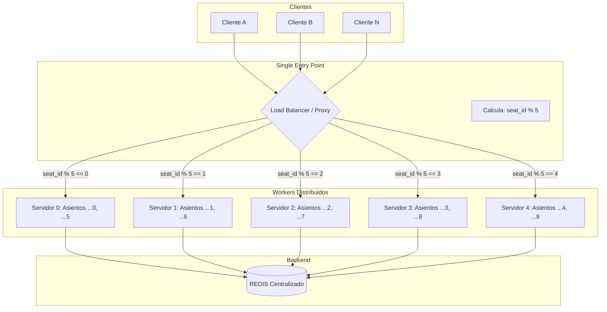

```mermaid
graph TD
    subgraph Clientes
        C1[Cliente A]
        C2[Cliente B]
        C3[Cliente N]
    end

    subgraph Punto_de_Entrada_Unico [Single Entry Point]
        LB{Load Balancer / Proxy}
        note[Calcula: seat_id % 5]
    end

    subgraph Cluster_de_Servidores [Workers Distribuidos]
        S0[Servidor 0: Asientos ...0, ...5]
        S1[Servidor 1: Asientos ...1, ...6]
        S2[Servidor 2: Asientos ...2, ...7]
        S3[Servidor 3: Asientos ...3, ...8]
        S4[Servidor 4: Asientos ...4, ...9]
    end

    subgraph Persistencia_y_Consistencia [Backend]
        R[(REDIS Centralizado)]
    end

    %% Flujo de peticiones
    C1 --> LB
    C2 --> LB
    C3 --> LB

    %% Lógica de Sharding
    LB -- "seat_id % 5 == 0" --> S0
    LB -- "seat_id % 5 == 1" --> S1
    LB -- "seat_id % 5 == 2" --> S2
    LB -- "seat_id % 5 == 3" --> S3
    LB -- "seat_id % 5 == 4" --> S4

    %% Acceso a Datos
    S0 --> R
    S1 --> R
    S2 --> R
    S3 --> R
    S4 --> R
```
